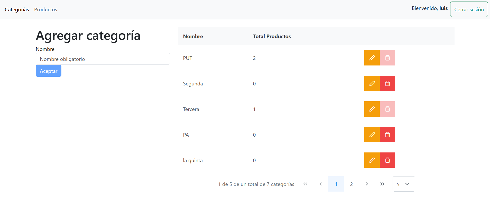
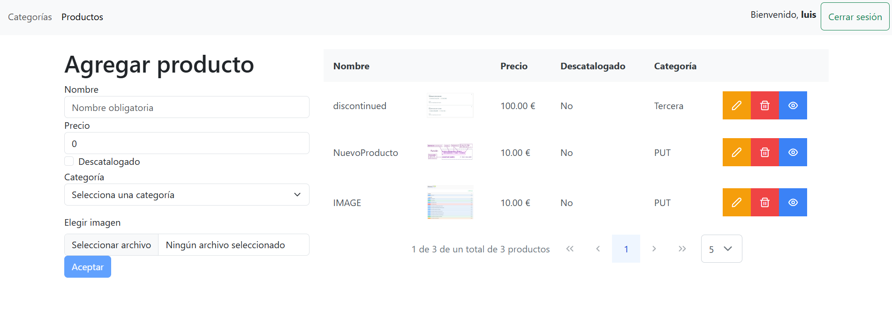

## AngularAlmacen

**AngularAlmacen** is a web application developed with Angular. Its main function is to manage a warehouse, allowing for the administration of categories and products.
This project was generated with [Angular CLI](https://github.com/angular/angular-cli) version 16.2.14.


AngularAlmacen/  
├───app/  
│   ├───almacen/  
│   │   ├───categorias/  
│   │   │   ├───categorias.component.html  
│   │   │   └───categorias.component.ts  
│   │   ├───productos/  
│   │   │   ├───productos.component.html  
│   │   │   └───productos.component.ts  
│   │   ├───almacen-routing.module.ts  
│   │   ├───almacen.component.html  
│   │   ├───almacen.component.ts  
│   │   ├───almacen.interfaces.ts  
│   │   └───almacen.module.ts  
│   ├───guards/  
│   │   └───auth-guard.service.ts  
│   ├───inicio/  
│   │   ├───login/  
│   │   │   ├───login.component.css  
│   │   │   ├───login.component.html  
│   │   │   └───login.component.ts  
│   │   ├───not-found/  
│   │   │   ├───not-found.component.css  
│   │   │   ├───not-found.component.html  
│   │   │   └───not-found.component.ts  
│   │   └───inicio.module.ts  
│   ├───interfaces/  
│   │   └───login.interfaces.ts  
│   ├───services/  
│   │   └───app.service.ts  
│   ├───shared/  
│   │   ├───navbar/  
│   │   │   ├───navbar.component.html  
│   │   │   └───navbar.component.ts  
│   │   └───shared.module.ts  
│   ├───app-routing.module.ts  
│   ├───app.component.html  
│   ├───app.component.ts  
│   └───app.module.ts  
├───environments/  
│   ├───environment.development.ts  
│   └───environment.ts  
└───angular.json  






[DeepWiki moraisLuismNet/AngularAlmacen](https://deepwiki.com/moraisLuismNet/AngularAlmacen)


## environment

```
export const environment = {urlAPI: 'https://localhost:7044/api/'};
```

## Development server

Run `ng serve` for a dev server. Navigate to `http://localhost:4200/`. The application will automatically reload if you change any of the source files.

## Code scaffolding

Run `ng generate component component-name` to generate a new component. You can also use `ng generate directive|pipe|service|class|guard|interface|enum|module`.

## Build

Run `ng build` to build the project. The build artifacts will be stored in the `dist/` directory.

## Running unit tests

Run `ng test` to execute the unit tests via [Karma](https://karma-runner.github.io).

## Running end-to-end tests

Run `ng e2e` to execute the end-to-end tests via a platform of your choice. To use this command, you need to first add a package that implements end-to-end testing capabilities.

## Further help

To get more help on the Angular CLI use `ng help` or go check out the [Angular CLI Overview and Command Reference](https://angular.io/cli) page.

